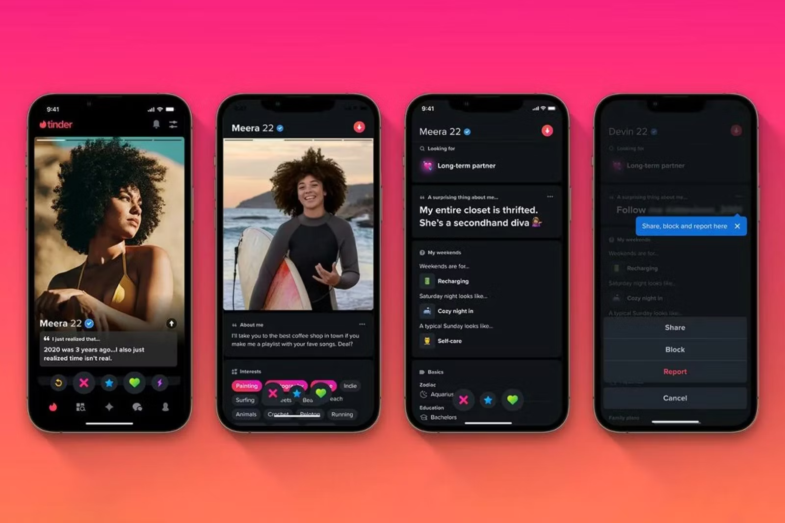

# 📱Tinder Dating App - Google Play Store Review

## 1. 프로젝트 주제

- 데이팅 앱 'tinder(틴더)'의 구글 앱 스토어 사용자 리뷰를 분석한다.

- 틴더 유저와 유저가 아닌 사람을 대상으로 관계의 성공 여부를 Yes or No로 예측하는 딥러닝 모델을 만든다.

  

## 2. 주제 선정 이유 및 목표

새로운 인연을 만들고 교류하기 위한 온라인 데이팅 앱을 지속적으로 많은 인기를 얻고 있으며 유저 수도 방대하다. 

해당 앱이 유저에게 어떠한 평을 받고 있는지, 유저가 앱을 이용하며 실제로 좋은 인연을 찾는 데 성공했는지 궁금해 이를 분석하고자 해당 주제를 선정하게 되었다.

## 3. 자연어(한국어 or 영어)와 숫자 데이터가 포함된 데이터셋 준비 과정

프로젝트에 사용한 데이터셋은 3가지이다.

1. Tinder Dating App - Google Play Store Review

- 데이팅 앱 틴더의 구글 앱스토어 사용자 리뷰 데이터

- 캐글 사이트에서 다운로드 후 txt 파일로 가공했다. 

- 출처: https://www.kaggle.com/datasets/shivkumarganesh/tinder-google-play-store-review

2. Tinder Millennial Match

- The dataset contains information about the match rate of the individuals from different universities, and whether the app (i.e. Tinder) has helped them find a relationship.

- 캐글 사이트에서 다운로드 받은 후 가공했다.

    - train(관계 성공 여부, 즉 y값이 포함된 데이터셋), test(y값이 없는 데이터셋)으로 나누어져 있어, test set은 예측에 활용함 

- https://www.kaggle.com/datasets/gauravduttakiit/tinder-millennial-match

  

## 4. 다양한 딥러닝 모델 중에서 제일 좋은 성능을 나타낸 모델을 중심으로 요약 정리

각 모델 별로 랜덤 시드와 epoch 횟수, batch size를 다양하게 실험해 가며 훈련시켰고, 총 6개의 파일이 있다.

이 단계에서 진행한 딥러닝 모델 및 세부사항은 다음과 같다. 

### 1. Keras의 Sequential 모델을 사용한 틴더의 relationship 성공 여부 예측

    test 데이터셋으로 평가한 accuracy : (epoch 200) 0.6151

### 2. ModelCheckpoint와 Earlystopping callback함수를 이용한 틴더의 relationship 성공 여부 예측

    test 데이터셋으로 평가한 accuracy : (epoch 3000) 0.6796

### 3. Tensorboard로 시각화한 틴더의 relationship 성공 여부 예측

    test 데이터셋으로 평가한 accuracy : (epoch 100) 0.6608

### 4. Simple RNN 모델을 사용한 틴더의 relationship 성공 여부 예측

    test 데이터셋으로 평가한 accuracy : (epoch 500) 0.3445

### 5. DNN 모델을 사용한 틴더의 relationship 성공 여부 예측

    test 데이터셋으로 평가한 accuracy : (epoch 200) 0.6555

### 6. LSTM 모델을 사용한 틴더의 relationship 성공 여부 예측

    test 데이터셋으로 평가한 accuracy : (epoch 300) 0.8067

- 가장 좋은 성능을 낸 모델은 정확도 0.8067의 LSTM 모델이었다. 그 이유는, 기존 RNN이 입력 데이터가 길어지면 기울기 소실 문제를 일으켜 이전 정보를 제대로 기억하지 못하는 반면, LSTM은 기울기 소실 문제를 줄일 수 있기 때문일 것이다. 또한 이전 정보를 오랫동안 기억하여, 기존 RNN이 가지고 있는 단기 기억의 한계를 극복하고 방대한 데이터를 효과적으로 다룰 수 있었을 것이다.  

- 반면 simple RNN은 에포크를 500번 이상으로 늘려도 정확도가 별로 나아지지 않았는데, 위에서 언급한 단점이 작용했을 것으로 추측된다. 또한 오버피팅의 문제도 발생했을 것이다. 

- Sequential basic model을 사용했을 때(1,2,3)는 정확도가 0.6~0.75 사이를 기록했다. 하지만 loss가 상대적으로 큰 것을 발견할 수 있었다. 6_Deep Learning_(2)에서 Earlystopping callback 함수를 사용하고 에포크를 3000으로 늘려서 훈련했을 때에는 성능과 loss가 조금 개선되었다. 

- DNN, LSTM 모델을 사용했을 때에는 loss가 0.6442, 0.3722로 이전보다 월등히 줄어들었다.  

  

## 5. Term Project를 수행한 후 느낀점

자연어 처리, 데이터 가공 및 분석, 시각화, 딥러닝 등 1학기 동안 공부했던 토픽들을 총망라해 프로젝트를 수행할 수 있어 뜻깊었다. 실생활에서 유용하게 쓰일 법한 주제들로 딥러닝 프로젝트를 한 것이 의미 있었다. 앞으로 다양한 주제로 발전시켜 AI공부를 이어나가고 싶다.

